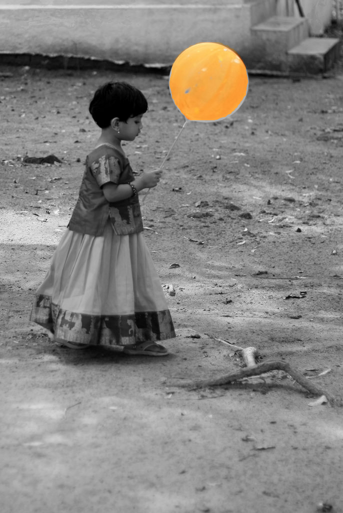

## 🚀 MASK-RCNN을 적용한 객체 인식 프로젝트

(공식 github 홈페이지 https://github.com/matterport/Mask_RCNN)
- **Sample Balloon** 학습 (Anaconda 기반 로컬 코드 활용)
- 참고 (https://hdongle.tistory.com/202) 감사합니다.

## 📖 상세 내용 (코드 & 실행 방법)

[instruction.ipynb](./instruction.ipynb)

instruction.ipynb 파일에서 Sample Balloon 학습을 위해 사용한 코드 정리 (실행환경: Anaconda Prompt)

## 🛠️ 결과

### interference 할 이미지

</img><br/>

### interference 결과 이미지

</img><br/>

### 코드 실행

```python
python balloon.py --dataset ../../model/balloon/datasets --weights ../../mask_rcnn_balloon.h5 --logs ../../model/balloon/logs --image ../../model/balloon/datasets/val/3800636873_ace2c2795f_b.jpg splash
```


